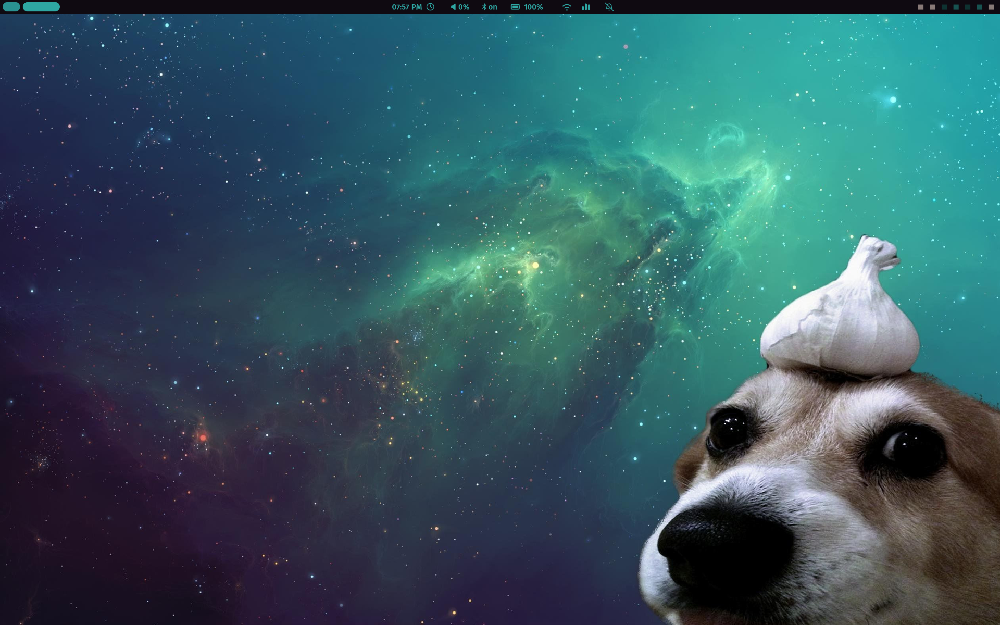
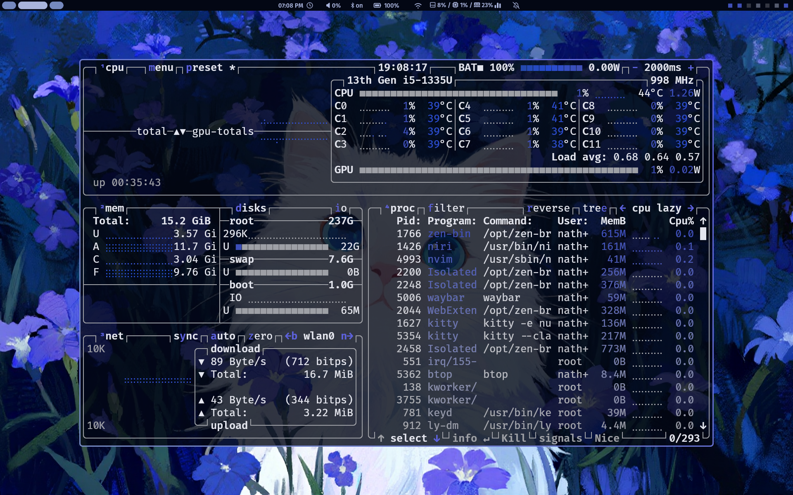
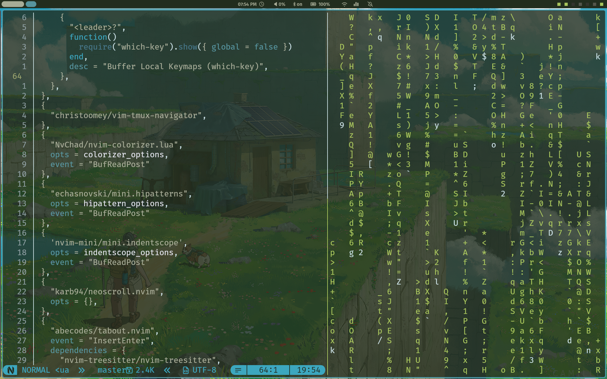
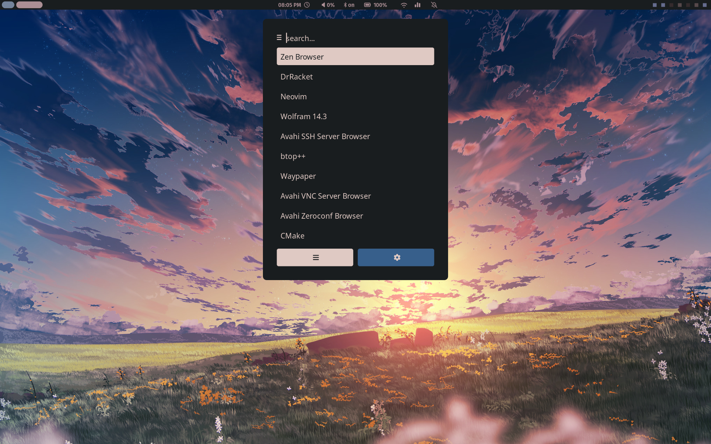
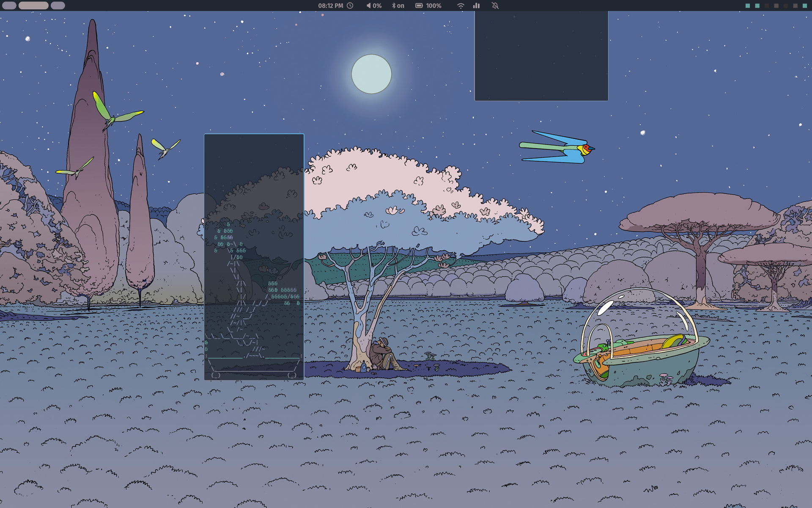

# My Setup :]

## Screenshots

### Desktop


### Btop


### Terminal & Editor


### Rofi & Waybar


### Niri Overview


## Table of Contents
- [Screenshots](#screenshots)
- [Applications](#applications)
- [Installation](#installation)
- [Configuration](#configuration)
- [Usage](#usage)

## Applications
I use these apps :O

### Core
- **Shell**: zsh, (nushell for interactive)
- **Terminal**: ghostty
- **Multiplexer**: tmux
- **Editor**: neovim
- **WM**: niri

### Desktop Environment
- **Status Bar**: waybar
- **Launcher**: rofi
- **Notifications**: swaync
- **Lock Screen**: hyprlock
- **Idle Daemon**: hypridle
- **Display Manager**: ly
- **Wallpaper**: swww
- **Theming**: pywal

### System
- **Keyboard Remapping**: keyd
- **Power Management**: tlp (laptop only)

---

## Installation

If you're using nixos you already know what to do

### Fresh Install

1. **Clone the repository**
```bash
git clone https://github.com/Nathaniel-St-S/dotfiles.git ~/dotfiles
```

2. **Apply the configuration** (replace `<hostname>` with `kinixys`, `sinixt` or whatever host you make)
```bash
sudo nixos-rebuild switch --flake ~/dotfiles#<hostname>
```

3. **Reboot**

### Adding a New Host

1. Generate hardware config on the target machine:
```bash
sudo nixos-generate-config --show-hardware-config > nix/hosts/<hostname>/hardware-configuration.nix
```

2. Create `nix/hosts/<hostname>/default.nix`:
```nix
{ ... }: {
  imports = [ ./hardware-configuration.nix ];
  networking.hostName = "<hostname>";
}
```

3. Register the host in `flake.nix` under `nixosConfigurations`:
```nix
<hostname> = mkHost {
  hostname = "<hostname>";
  isLaptop = true; # or false
};
```

---

## Configuration

### Initial Setup

**Set wallpaper & generate colorscheme**
```bash
waypaper
# This opens the waypaper GUI
# On first launch, run generate-colors or random-wallpaper manually to apply the theme:
generate-colors || random-wallpaper
```

### Customization

#### Keyboard Remapping
Managed via `keyd` in `nix/modules/system/common.nix`:
- CapsLock → Escape (tap) / Control (hold)
- Tab → Meta (hold) / Tab (tap)
- Shift+Space → Delete
- Meta+Alt+R/S/P → reboot / suspend / poweroff

#### Theming
Wallpaper changes automatically update all application themes via `generate-colors`, which:
1. Runs pywal to generate a colorscheme from the wallpaper
2. Updates colors for waybar, rofi, niri borders, btop, and swaync
3. Reloads swaync and restarts waybar

---

## Usage

### Rebuilding
```bash
# Apply config (zsh/nushell alias)
switch

# Test without making it the default boot entry
test

# Roll back to the previous generation
rollback
```

### Maintenance
```bash
# Garbage collect
gcollect        # nix-collect-garbage
gcollectd       # nix-collect-garbage -d (removes all old generations)

# Update flake inputs
flakeup

# Optimise nix store
optimize
```

### Theming
```bash
# Use wallpaper picker
waypaper

# Manually regenerate colors from the current wallpaper
generate-colors

# Choose a random wallpaper and apply it's theme
# There is a Niri keybind for this, Mod+Alt+w
random-wallpaper
```

